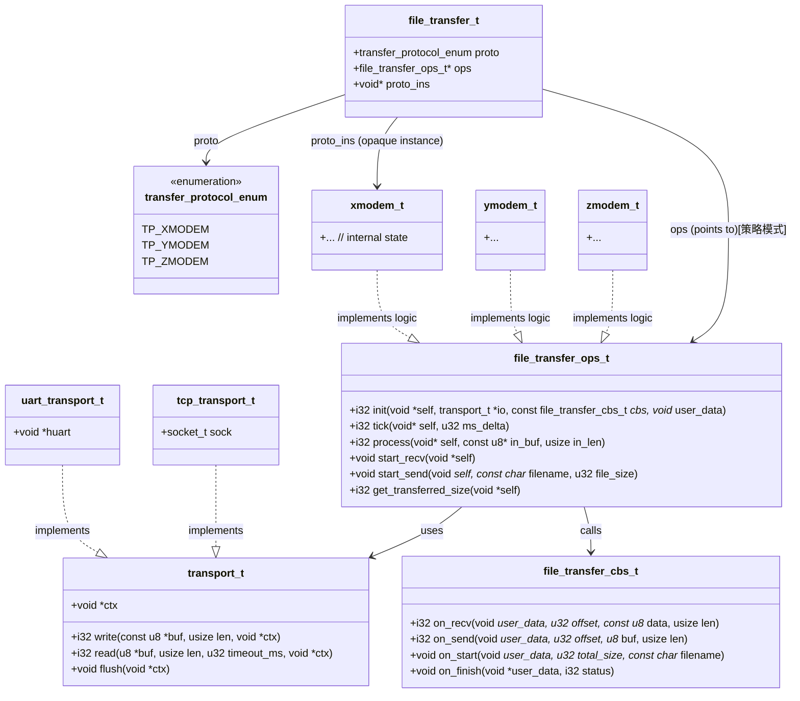
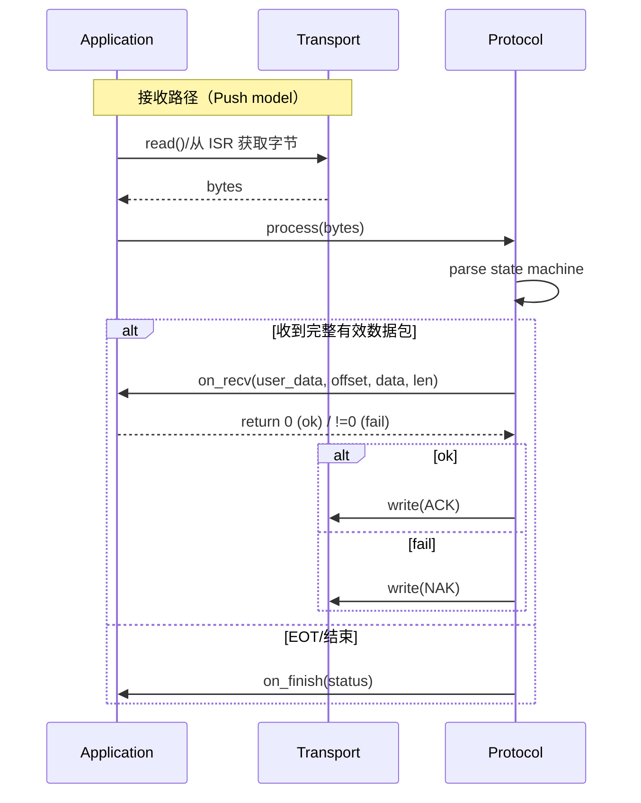
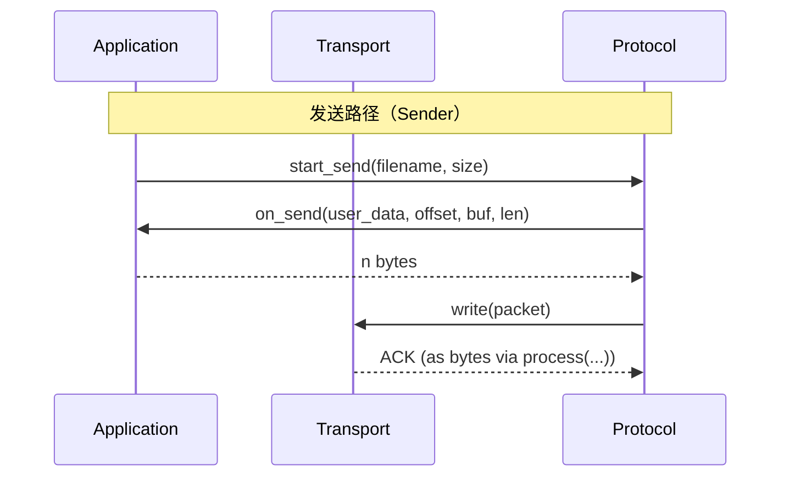

类图

```mermaid
%% Class Diagram: 数据结构、接口与具体实现
classDiagram
    %% Interfaces / core structs
    class transport_t {
        +i32 write(const u8 *buf, usize len, void *ctx)
        +i32 read(u8 *buf, usize len, u32 timeout_ms, void *ctx)
        +void flush(void *ctx)
        +void *ctx
    }

    class file_transfer_ops_t {
        +i32 init(void *self, transport_t *io, const file_transfer_cbs_t *cbs, void* user_data)
        +i32 tick(void* self, u32 ms_delta)
        +i32 process(void* self, const u8* in_buf, usize in_len)
        +void start_recv(void *self)
        +void start_send(void *self, const char* filename, u32 file_size)
        +i32 get_transferred_size(void *self)
    }

    class file_transfer_cbs_t {
        +i32 on_recv(void *user_data, u32 offset, const u8* data, usize len)
        +i32 on_send(void *user_data, u32 offset, u8* buf, usize len)
        +void on_start(void *user_data, u32 total_size, const char* filename)
        +void on_finish(void *user_data, i32 status)
    }

    class file_transfer_t {
        +transfer_protocol_enum proto
        +file_transfer_ops_t* ops
        +void* proto_ins
    }

    class transfer_protocol_enum {
        <<enumeration>>
        TP_XMODEM
        TP_YMODEM
        TP_ZMODEM
    }

    %% Concrete protocol implementations
    class xmodem_t {
        +... // internal state
    }
    class ymodem_t {
        +...
    }
    class zmodem_t {
        +...
    }

    %% Transport implementations
    class uart_transport_t {
        +void *huart
    }
    class tcp_transport_t {
        +socket_t sock
    }

    %% 具体实现类通过 "实现" 关系关联到接口，与 file_transfer_t 解耦
    xmodem_t ..|> file_transfer_ops_t : implements logic
    ymodem_t ..|> file_transfer_ops_t : implements logic
    zmodem_t ..|> file_transfer_ops_t : implements logic

    uart_transport_t ..|> transport_t : implements
    tcp_transport_t ..|> transport_t : implements

    file_transfer_t --> file_transfer_ops_t : ops (points to)[策略模式]
    file_transfer_t --> xmodem_t : proto_ins (opaque instance)
    file_transfer_t --> transfer_protocol_enum : proto
    file_transfer_ops_t --> transport_t : uses
    file_transfer_ops_t --> file_transfer_cbs_t : calls
```

时序图

接收者路径

```mermaid
%% Sequence Diagram: 接收与发送 （Push model）
sequenceDiagram
    participant App as Application
    participant Tr as Transport
    participant P as Protocol

    Note over App,Tr: 接收路径（Push model）
    App->>Tr: read()/从 ISR 获取字节
    Tr-->>App: bytes
    App->>P: process(bytes)
    P->>P: parse state machine
    alt 收到完整有效数据包
        P->>App: on_recv(user_data, offset, data, len)
        App-->>P: return 0 (ok) / !=0 (fail)
        alt ok
            P->>Tr: write(ACK)
        else fail
            P->>Tr: write(NAK)
        end
    else EOT/结束
        P->>App: on_finish(status)
    end
```

发送者路径

```mermaid
%% Sequence Diagram: 接收与发送 （Push model）
sequenceDiagram
    participant App as Application
    participant Tr as Transport
    participant P as Protocol

    Note over App,P: 发送路径（Sender）
    App->>P: start_send(filename, size)
    P->>App: on_send(user_data, offset, buf, len)
    App-->>P: n bytes
    P->>Tr: write(packet)
    Tr-->>P: ACK (as bytes via process(...))
```

