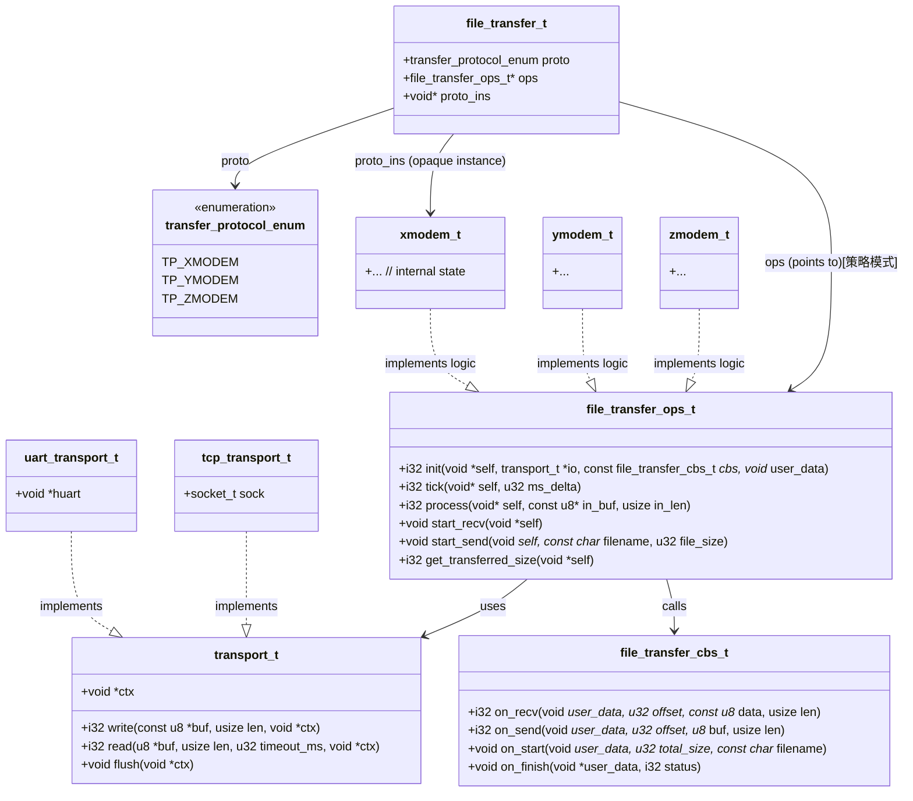
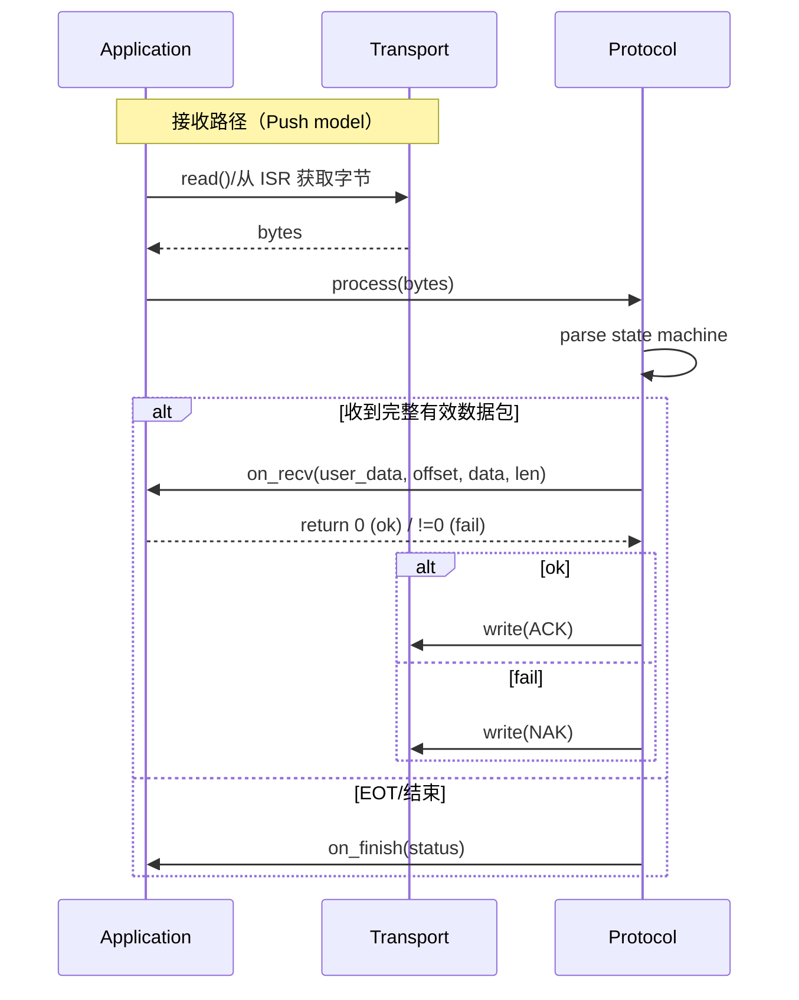
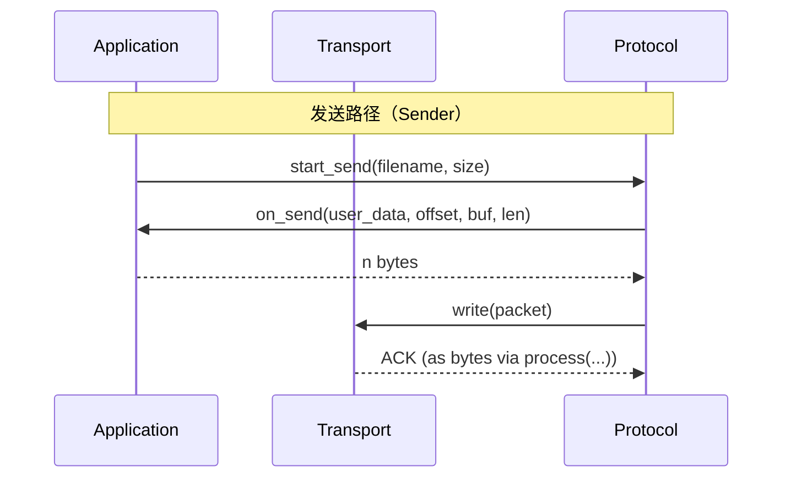

## em_protocol 设计文档

本模块实现了标准的 XMODEM/YMODEM 协议，支持接收端和发送端模式。设计上充分考虑了嵌入式环境的限制，具有低内存占用、无动态分配和高可靠性的特点。

## 设计特性

1. **无动态内存分配**：所有缓冲区均在 `xmodem_t` 结构体中静态分配或由用户提供，避免了内存碎片。
2. **基于 RingBuffer**：输入输出均通过环形缓冲区解耦，易于集成到串口中断或 DMA 环境中。
3. **双模支持**：通过简单的配置即可切换发送或接收模式。
4. **鲁棒性**：内置超时重传、错误计数、CRC/Checksum 自动协商以及取消传输（CAN）处理。
5. **流式处理**：支持边接收边处理数据，无需等待整个文件接收完成。

---

## 架构设计

### 类图



### 时序图

#### 接收者路径



#### 发送者路径



---

## 快速上手示例

### 1. 接收端示例 (MCU 固件升级场景)

模拟一个典型的 MCU 环境：串口中断接收数据，主循环通过 `file_transfer_t` 抽象层处理协议，解析后的数据写入 Flash。

```c
#include "xmodem.h"

// 全局对象
xmodem_t        g_xm;
file_transfer_t g_transfer;
ringbuffer_t    g_rb, g_sb;
uint8_t         rb_mem[1024]; 
uint8_t         sb_mem[128];

// --- 硬件底层接口 ---
void uart_send(const uint8_t* data, size_t len) {
    // HAL_UART_Transmit(&huart1, (uint8_t*)data, len, 100);
}

void flash_write(uint32_t offset, const uint8_t* data, size_t len) {
    // W25QXX_Write((uint8_t*)data, APP_START_ADDR + offset, len);
}

// --- 协议回调 ---
void on_xmodem_data(const u8* data, usize len, usize offset) {
    flash_write(offset, data, len);
}

int main() {
    // 1. 初始化环形缓冲区
    ringbuffer_init(&g_rb, rb_mem, sizeof(rb_mem));
    ringbuffer_init(&g_sb, sb_mem, sizeof(sb_mem));

    // 2. 初始化 XMODEM 协议实例
    xmodem_proto_init(&g_xm, &g_rb, &g_sb);
    xmodem_set_on_data_cb(&g_xm, on_xmodem_data);

    // 3. 绑定到统一传输接口 (方便后续切换 YMODEM 等)
    file_transfer_init(&g_transfer, TP_XMODEM, &g_xm);
    
    while (1) {
        // 5. 检查并发送回复包 (如 ACK/NAK/C)
        uint8_t tx_temp[128];
        i32 tx_len = g_transfer.ops->poll(g_transfer.proto_ins, tx_temp, sizeof(tx_temp));
        if (tx_len > 0) {
            uart_send(tx_temp, tx_len);
        }
        
        // 处理其他业务或进入低功耗模式
        __WFI(); 
    }
}

// 10ms 定时器中断
void Timer1_10ms_IRQHandler(void) {
    // 4. 驱动协议栈定时器 (处理超时重传)
    g_transfer.ops->tick(g_transfer.proto_ins, 10);
}

// 串口接收中断
void USART1_IRQHandler(void) {
    if (UART_GET_FLAG(UART_FLAG_RXNE)) {
        uint8_t data = UART_RECEIVE_DATA();
        // 6. 直接在中断中喂入数据并触发协议解析
        g_transfer.ops->process(g_transfer.proto_ins, &data, 1);
    }
}
```

### 2. 发送端示例 (上位机/主控发送场景)

模拟从文件系统读取数据并发送给从机。

```c
#include "xmodem.h"

xmodem_t g_xm;
FILE*    g_file;

// --- 数据获取回调 ---
usize on_tx_fetch(u8* buf, usize len, usize offset) {
    fseek(g_file, offset, SEEK_SET);
    return fread(buf, 1, len, g_file);
}

void send_file_xmodem(const char* path) {
    g_file = fopen(path, "rb");
    fseek(g_file, 0, SEEK_END);
    usize file_size = ftell(g_file);
    
    // 初始化并设置为发送模式
    xmodem_proto_init(&g_xm, &rb, &sb);
    xmodem_set_as_transmitter(&g_xm, file_size);
    xmodem_set_on_tx_fetch_cb(&g_xm, on_tx_fetch);

    while (g_xm.state != STATE_FINISHED && g_xm.state != STATE_ERROR) {
        // 1. 喂入串口数据
        uint8_t rx_byte;
        if (serial_read(&rx_byte)) {
            xmodem_process(&g_xm, &rx_byte, 1);
        }

        // 2. 驱动定时器
        xmodem_tick(&g_xm, 1);

        // 3. 发送回复包
        uint8_t tx_buf[1029];
        i32 tx_len = xmodem_poll(&g_xm, tx_buf, sizeof(tx_buf));
        if (tx_len > 0) {
            serial_write(tx_buf, tx_len);
        }
    }
    
    fclose(g_file);
}
```

---

## 核心设计

### 1. 零内存分配 (Zero Malloc)

协议栈内部使用静态缓冲区 `packet_buf[1029]`，完全不依赖 `malloc/free`，适用于内存受限的嵌入式系统。

### 2. 统一传输接口 (`file_transfer_t`)

通过 `file_transfer_ops_t` 抽象了 `process`, `tick`, `poll` 三个核心动作。这使得应用层代码可以轻松在 XMODEM, YMODEM 等协议间切换，而无需修改主逻辑。

### 3. 环形缓冲区集成

强制要求使用 `ringbuffer_t` 作为 I/O 缓冲，有效隔离了硬件中断与协议解析逻辑，避免了在高波特率下的丢包问题。

---

## 错误处理

通过 `on_error(i32 err_code, void* err_data)` 回调处理异常：

| 错误码 | 含义 | 说明 |
| :--- | :--- | :--- |
| `XMODEM_ERR_RB_TOO_SMALL` | 缓冲区过小 | 用户提供的 RingBuffer 无法容纳一个完整包 |
| `XMODEM_ERR_TIMEOUT` | 等待超时 | 对方长时间未响应 |
| `XMODEM_ERR_RETRY_EXCEED` | 重试超限 | 连续校验失败或超时次数达到上限 |
| `XMODEM_ERR_CANCELLED` | 传输取消 | 对方发送了 CAN 信号 |

---

## 状态机说明

模块内部维护了一个状态机，主要状态包括：

- `STATE_WAIT_START`: 等待/发送启动信号
- `STATE_WAIT_PACKET`: (Rx) 等待数据包
- `STATE_TX_SEND_PACKET`: (Tx) 发送数据包
- `STATE_TX_WAIT_ACK`: (Tx) 等待确认
- `STATE_FINISHED`: 传输成功完成
- `STATE_ERROR`: 发生不可恢复错误